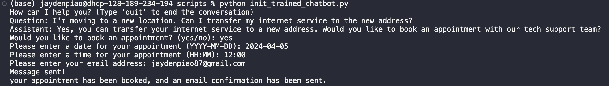
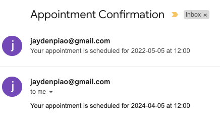
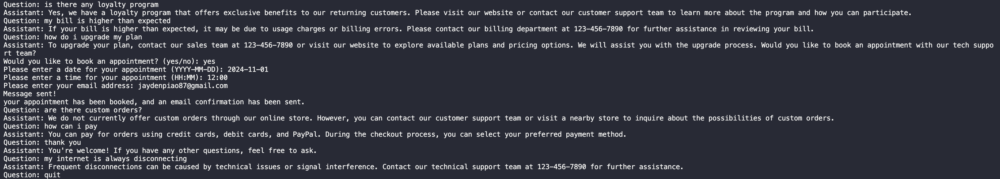

# customer-service-chatbot

## Setup

- pip install -r requirements.txt
- get openai api key from https://platform.openai.com/api-keys
- store api key in .env as OPENAI_APIKEY="api_key_goes_here"
- install dataset: https://www.kaggle.com/datasets/saadmakhdoom/ecommerce-faq-chatbot-dataset

## To run single question chatbot

python scripts/init_single_question_chatbot.py

## To run continuous question chatbot

python scripts/init_continuous_question_bot.py

## To run trained model chatbot

1. cd scripts
2. python init_trained_chatbot.py

## To run data cleaning script

1. edit file_path to be path to the raw data
2. cd utils
3. python data_preprocessing.py

## To run script to convert json to jsonl

1. edit input_filename and output_filename
2. cd utils
3. python convert_to_jsonl.py

## To run script to upload jsonl data to openai api

1. edit file path
2. cd utils
3. python upload_data.py
4. https://platform.openai.com/storage
5. save file id in .env as OPENAI_APIKEY="file_id_goes_here"

## To run script to train model

1. cd utils
2. python train_model.py
3. check status here https://platform.openai.com/finetune
4. once training is finished, save model id in .env as TRAINED_MODELID="model_id_goes_here"

### Model trained with 3 epochs

### Booking an appointment

### Model trained with 8 epochs

## Missing Details

### Integration with existing customer service platforms

1. Need access to CRM/database through API keys or OAuth.
2. Fetch customer data from customer id which personalizes the interaction
3. Create module that holds API calls to CRM/db such as getting and updating customer data
4. Webhooks for real-time updates. Lets chatbot react to changes in customer data
5. Must ensure high security
6. Give the model more data that is user specific (billing details, current plan)

### Escalating issues from chatbot to human agents

1. Will need to detect triggers like keywords/phrases that show frustration or a complex issue. Use NLP to analyze sentiment.
2. Once triggered, chatbot should inform the user that a human will take over and provide a estimated wait time. There will need to be notifications sent to human agents when triggers are detected
3. Generate a summary of the conversation to the human agent and allow them to view the history. Also, allow agent to see all customer data accessed by chatbot
4. Ensure that the user stays in same interface when transfer happens. Agent should have a quick generated introduction
5. Implement a feedback loop where agents can provide feedback on the chatbot's performance and escalation triggers
6. Add escalation cases to data set to try to identify trends and repeat issues

## Evaluation

### Key Performance Indicators (KPIs)

- Response time: Manageable even with higher epochs (1-3sec).

- Conversation length: Short. Difficult to talk about the same concept continuously since the dataset is designed to answer the query in one response.

- Appointment booking: Tedious since user needs to input details like email, date, and time. Email should be fetched automatically from database and the chatbot should either give the user options in a dropdown-esque format or sent a link to book a time easily.

- Responses: Many of the responses give a short description of how to fix the issue. Many are very vague and most end up telling the user to call customer support if they need additional help which would likely be the case here. This is expected because of the small and focused dataset.

- Detection: The model is decent at detecting the right category and giving a reasonable answer. This is due to very specific answers in the dataset that have been repeated multiple times. If the model doesn't know, it will simply say it doesn't know and to contact customer support.

- Cost: Expensive. From training about 3-5 models and making ~40 queries, the api usage is at $0.65USD.

- Technical issues: Minimal since the model is simple and there's a limited amount of different scenarios.

- Overall, it is a decent chatbot for the small dataset it was given. It is able to categorize queries quite well and is accurate most of the time in terms of its responses. With 3 epochs, answers varied and there were some that the model made up which is not wanted. But with 8, it is much more accurate and doesn't tend to mess up. There is a lot of potential.
