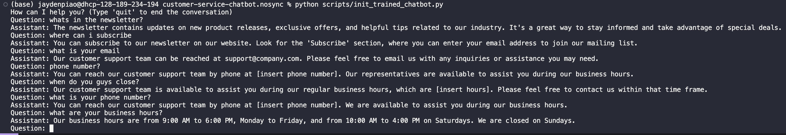

# customer-service-chatbot

## Setup

- pip install -r requirements.txt
- get openai api key from https://platform.openai.com/api-keys
- store api key in .env as OPENAI_APIKEY="api_key_goes_here"

## To run single question chatbot

python scripts/init_single_question_chatbot.py

## To run continuous question chatbot

python scripts/init_continuous_question_bot.py

## To run data cleaning script

1. edit file_path to be path to the raw data
2. cd utils
3. python data_preprocessing.py

## To run script to convert json to jsonl

1. edit input_filename and output_filename
2. cd utils
3. python convert_to_jsonl.py

## To run script to upload jsonl data to openai api

1. edit file path
2. cd utils
3. python upload_data.py
4. https://platform.openai.com/storage
5. save file id in .env as OPENAI_APIKEY="file_id_goes_here"

## To run script to train model

1. cd utils
2. python train_model.py
3. check status here https://platform.openai.com/finetune
4. once training is finished, save model id in .env as TRAINED_MODELID="model_id_goes_here"

### Model trained with 3 epochs

